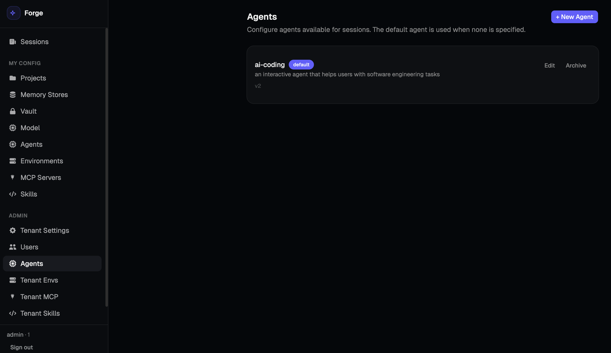

# Claude-Managed-Agents

**Claude-Managed-Agents** 是一个生产级多租户 AI Agent 平台，以 Go 语言实现，支持多会话并发、多智能体协同、上下文压缩与插件化工具生态，可部署于本地开发环境或 Kubernetes 集群。

> 架构设计参考：[docs/系统架构设计文档.md](docs/系统架构设计文档.md)

---

## 设计来源：Anthropic Managed Agents

AI-Forge 的整体架构参考了 **Anthropic Managed Agents** 的设计思路，并在此基础上加入多租户、多节点部署等生产级能力。

**Anthropic Managed Agents** 的核心思想是：

- **效果循环（Effect Loop）**：Agent 是一个持续的驱动循环——接收用户输入，调用 LLM 推理，执行工具，再将结果反馈回 LLM，直到任务完成。这个循环由 **Harness** 组件驱动。
- **组件分层、职责单一**：将 Agent 拆分为 Orchestration、Harness、Brain、Session、History、Sandbox、Permission 等独立层次，声明与执行分离，推理与存储分离。
- **上下文感知与压缩**：通过分层压缩策略（MicroCompact → StripToolResults → GlobalCompact）将有效上下文维持在合理窗口内。
- **工具系统插件化**：工具的声明（ToolRegistry）与执行（Sandbox）完全解耦，Brain 只感知工具的 JSON Schema，不感知执行细节。
- **多智能体协同**：Agent 通过 `dispatch_agent_task` 工具派发子任务，子 Agent 在进程内并发执行（最大 25 个并发），结果同步返回给 Coordinator。

AI-Forge 在此基础上增加了 **Platform → Tenant → User** 三层多租户隔离、Vault 凭证加密服务、MCP（Model Context Protocol）动态工具接入、EventBus 多节点 SSE 分发、HITL 人工确认门控，以及 Kubernetes 多节点部署方案。

---

## 平台架构




### 实体关系

```
Platform
  └── Tenant  ──────────────────── 权限规则 · 资源配额 · 模型配置
        ├── Agent ────────────────── 可复用 Agent 模板（模型 · 提示词 · 工具集 · MCP · Skill）
        ├── Environment ─────────── 沙箱运行时模板（包依赖、网络策略）
        ├── Vault ───────────────── AES-256-GCM 凭证加密（租户级 & 用户级）
        └── User  ──────────────── admin / member / viewer 三级角色
              ├── MemoryStore ───── 自定义知识库（可见性 / 写入权限可配置）
              └── Project ──────── Git 仓库 · 参考文件 · Environment 覆盖
                    └── Session
                          ├── Brain ────── LLM 推理 + MCP 工具 + Skill 模板
                          ├── Sandbox ──── Environment 实例化（Docker / K8s Pod）
                          ├── Resources ── FileResource · GitResource（运行时挂载）
                          ├── CustomTools  创建时内联传入的客户端执行工具（不独立存储）
                          └── Memory ───── User / Project / Tenant / Custom 多作用域
```

Session 创建时按 Agent 指定的工具集和 MCP 配置构建 Brain；若指定了 AgentID，则使用该 Agent 的系统提示词和模型覆盖。Environment 按 Project 指定 → 租户默认 → 空环境的优先级解析，实例化为 Session 专属 Sandbox。

### 部署架构

**多节点 Kubernetes**：

```
┌─────────────────────────────────────────────────────────────────────────┐
│                            Ingress / LB                                 │
└───────────────┬─────────────────────────────────────────────────────────┘
                │
                ▼
┌────────────────────────────────┐       ┌─────────────────────────┐
│  forge-coordinator × N         │       │  Redis (EventBus +       │
│  HTTP :8080                    │ ────▶ │  PendingStore)           │
│  Brain + SubAgent              │       │                          │
└────────────────────────────────┘       └─────────────────────────┘
                │
┌─────────────────────────────────────────────────────────────────────────┐
│  User Sandbox Pods（会话独立）                                             │
│  sandbox-alice   tool-server :7777   ClusterIP Service   NetworkPolicy  │
│  sandbox-bob     tool-server :7777   ClusterIP Service   NetworkPolicy  │
└─────────────────────────────────────────────────────────────────────────┘
                │ PVC bind
                ▼
┌─────────────────────────────────────────────────────────────────────────┐
│  NFS / EFS（forge-workspaces）                                            │
│  每用户独立子目录 → pod 内 /workspace                                      │
└─────────────────────────────────────────────────────────────────────────┘
```

| 组件 | 职责 | 扩容策略 |
|-----|------|---------|
| `forge-coordinator` | HTTP 接入 + Brain 推理 + 进程内 SubAgent | 水平扩容（无状态）|
| `Redis EventBus` | SSE 事件分发 + 跨节点中断信号 | 独立扩容 |
| `Redis PendingStore` | Custom Tool / HITL 结果跨节点传递 | 与 EventBus 共用 |
| `User Sandbox Pod` | 工具隔离执行，会话独立 | SandboxPool 按需创建/销毁 |

多节点部署时，各 Coordinator 节点通过 **Redis EventBus** 分发 SSE 事件——前端可连接任意节点获取实时流，无需 sticky session。**PendingStore** 同样使用 Redis，确保 Custom Tool 结果和 HITL 确认能跨节点送达。

### 核心特性

| 特性 | 说明 |
|------|------|
| **多租户隔离** | Platform → Tenant → User 三层，会话/记忆/工作空间按用户严格隔离，同一存储后端无需多 Schema |
| **Agent 模板** | 租户级可复用 Agent，封装模型、系统提示词、工具集、MCP、Skill，支持版本和归档；Session 创建时按 AgentID 加载 |
| **沙箱隔离执行** | Brain 只持有工具 JSON Schema（ToolRegistry），实际执行由 Sandbox 承担；Local / Docker / K8s 三级；凭证不进容器 |
| **七组件分层架构** | Orchestration / Harness / Brain / Session / History / Sandbox / Permission 单向依赖，独立可替换 |
| **EventBus 多节点 SSE** | memory / Redis 两种后端；SSE 支持事件回放；多节点无需 sticky session |
| **HITL 人工确认** | 工具执行前触发确认门控，Agent goroutine 挂起等待用户决策，支持跨节点（Redis PendingStore）|
| **Custom Tool 协议** | Session 创建时内联完整工具定义（不持久化），Agent 触发后等待客户端执行并通过 SSE 返回结果 |
| **Outcome Grader** | 目标驱动迭代，每轮用只读 Brain 主动验证 rubric，将反馈注入下一轮，直至满足或达到最大轮次 |
| **上下文压缩** | 三层压缩（MicroCompact → StripToolResults → GlobalCompact），保守 95K 阈值抑制 Context Rot |
| **Permission Engine** | Last-Match-Wins 规则评估；viewer 角色强制 plan 模式；per-request 模式覆盖 |
| **多智能体协同** | 进程内并发派发，`dispatch_agent_task` 工具同步返回结果，最多 25 个并发子 Agent |
| **MCP 工具** | stdio 本地进程 / SSE 远程服务，工具名自动命名空间化，支持自动重连 |
| **Skill** | Markdown 定义的提示词模板，支持编译内嵌和运行时动态加载，可关联到具体 Agent |
| **Memory 记忆** | .md 文档存储 + 全文搜索；User / Project / Tenant / Custom 四类作用域；工具驱动读写 |
| **Session Resources** | 运行时动态挂载 FileResource（内联/URL）和 GitResource（自动 clone）到沙箱工作空间 |
| **Vault 凭证** | AES-256-GCM 加密，用户独立子密钥（HKDF-SHA256）；`vault:secret_name` 引用，运行时注入不落盘 |

---

## 快速开始

### 1. 配置与构建

```bash
# 复制配置示例
cp configs/forge.example.yaml forge.local.yaml

# 填写 JWT 密钥（forge.local.yaml → auth.jwt_secret）
# 模型 API Key 通过租户设置配置，见下方"开通租户"步骤

# 设置 Vault 主密钥（用于加密凭证，不写入配置文件）
export FORGE_VAULT_KEY=$(openssl rand -base64 32)

# 构建后端
make build
```

### 2. 开通租户和管理员账号

```bash
# 创建租户，同时创建第一个 admin 用户
./forge admin create-tenant \
  --id myorg \
  --name "My Organization" \
  --admin-username admin \
  --admin-password changeme
```

- `--id`：租户唯一标识，后续 JWT 中携带，不可修改
- `--admin-username / --admin-password`：用于登录 Web UI 的管理员账号

### 3. 配置模型（租户级）

登录后通过管理 API 设置租户的模型配置（Anthropic API Key 存储在租户设置中，不写入配置文件）：

```bash
curl -X PATCH http://localhost:8080/api/admin/v1/tenant/settings \
  -H "Authorization: Bearer <admin-token>" \
  -H "Content-Type: application/json" \
  -d '{
    "model": {
      "provider": "anthropic",
      "api_key": "sk-ant-...",
      "model": "claude-sonnet-4-6"
    }
  }'
```

### 4. 启动后端

```bash
./forge serve -c forge.local.yaml
# 默认监听 :8080，可通过 --addr :9090 指定端口
```

### 5. 启动前端

```bash
cd web
npm install      # 首次运行需安装依赖
npm run dev      # 开发服务器，默认监听 http://localhost:5173
```

前端通过 Vite 代理将 `/api` 请求转发至后端 `http://localhost:8080`，无需额外跨域配置。

浏览器访问 **http://localhost:5173**，使用上一步创建的 admin 账号登录即可。

---

## 项目结构

```
forge/
├── cmd/                    # CLI 入口（serve, tool-server, sandbox-init, admin）
├── configs/                # 配置文件示例
├── docs/                   # 设计文档
│   └── 系统架构设计文档.md  # 完整架构说明
├── deploy/                 # 部署文档与 Kubernetes 清单
│   └── k8s/                # K8s YAML（app, rbac, secret）
├── internal/
│   ├── orchestration/      # HTTP 服务、多租户路由、JWT 认证
│   ├── harness/            # 效果循环（Harness）、HITL、Custom Tool、Grader
│   ├── brain/              # LLM 推理层（无状态，Eino ADK）
│   ├── history/            # 历史准备与上下文压缩触发
│   ├── compact/            # 三层压缩流水线
│   ├── eventbus/           # SSE 事件分发（memory / Redis）+ 中断信号
│   ├── gateway/
│   │   ├── session/        # Append-Only 事件日志（多后端）
│   │   ├── store/          # 应用存储（租户/用户/Agent/Project/Environment 等）
│   │   └── vault/          # 凭证加密存储
│   ├── hands/              # Sandbox 工具执行（Local / Docker / K8s）
│   ├── tools/              # 内置工具（文件系统、Shell、Git、Memory）+ 中间件
│   ├── permission/         # 权限引擎（Last-Match-Wins 规则评估）
│   ├── memory/             # 文档存储记忆系统（Pool + SessionStores）
│   ├── mcp/                # MCP 客户端管理
│   ├── skill/              # Skill 定义与执行
│   ├── subagent/           # 多智能体派发工具（进程内并发）
│   ├── resolver/           # Brain 生命周期管理（引用计数缓存）
│   ├── reqctx/             # 请求级 context 键（userID/tenantID/role/HITL gate 等）
│   ├── resources/          # 工作空间资源类型（Environment, FileResource, GitResource）
│   ├── entity/             # HTTP 请求/响应 DTO
│   ├── observability/      # 结构化日志初始化
│   ├── eino/               # Eino ADK 回调（工具事件、Span 统计）
│   ├── provider/           # 模型 Provider 抽象（Anthropic）
│   └── config/             # 全局配置加载
└── web/                    # React + TypeScript 前端（Vite）
```

---

## 配置说明

核心配置文件为 `forge.local.yaml`（基于 `configs/forge.example.yaml`）：

```yaml
server:
  http_addr: ":8080"

log:
  level: "info"      # debug | info | warn | error
  format: "text"     # text | json
  file: ""           # 留空输出到 stderr

auth:
  jwt_secret: "..."  # HS256 签名密钥（必填）

store:
  driver: "sqlite"   # sqlite / postgres.<name>

session:
  driver: "sqlite"   # sqlite / postgres.<name> / redis.<name>

memory:
  static:
    driver: "sqlite" # sqlite / postgres.<name>

tasks:
  driver: "sqlite"   # sqlite / postgres.<name>

sandbox:
  driver: "local"    # local（开发）/ docker（生产）/ k8s（集群）

# 多节点 SSE 分发（可选，默认 memory）
event_bus:
  driver: "memory"   # memory / redis

# 命名存储实例池（供上方各组件引用）
storage:
  postgres:
    default:
      dsn: "postgres://..."
  redis:
    default:
      addr: "localhost:6379"
```

MCP 工具服务器配置见 `forge.mcp.local.yaml`，权限规则配置见 `forge.permission.local.yaml`。

模型 API Key 通过租户设置（`PATCH /admin/v1/tenant/settings`）配置，不写入配置文件。

---

## SSE 双向事件协议

AI-Forge 采用双向 SSE 协议——服务端推送事件，客户端通过独立 HTTP 请求响应：

```
Client                         Server
  │── POST /v1/sessions/:id/run ──▶│
  │                                │── session.status_running ──▶
  │                                │── agent.thinking ──────────▶
  │                                │── agent.tool_use ──────────▶
  │                                │── agent.tool_result ────────▶
  │                                │── agent.message (tokens) ──▶
  │                                │── session.status_idle ──────▶
  │
  │ [HITL 确认]
  │── POST /v1/sessions/:id/events ──▶ {"type":"user.tool_confirmation","tool_use_id":"...","confirmed":true}
  │
  │ [Custom Tool 结果]（客户端执行 Session 创建时内联注册的工具后返回）
  │── POST /v1/sessions/:id/events ──▶ {"type":"user.custom_tool_result","tool_use_id":"...","content":"..."}
  │
  │ [中断运行中的 Agent]
  │── POST /v1/sessions/:id/events ──▶ {"type":"user.interrupt"}
  │
  │ [定义目标驱动迭代]
  │── POST /v1/sessions/:id/events ──▶ {"type":"user.define_outcome","message":"...","criteria":[...]}
```

SSE 订阅通过 `GET /v1/sessions/:id/events` 建立，支持 `?after_seq=N` 参数从指定序号回放历史事件。

---

## 安全注意事项

- **生产部署必须使用 `sandbox.driver: docker` 或 `k8s`**，禁止在宿主机进程中直接执行 Shell 命令
- `FORGE_VAULT_KEY` 必须以环境变量注入，不得写入配置文件或代码仓库
- MCP 服务器凭证通过 Vault 引用（`vault:secret_name`），不在 MCP 配置文件中明文存储
- 多节点部署时，Redis 连接必须启用 TLS 和认证
- Bash 工具访问权限通过 Permission Engine 管控，生产建议显式配置 `deny_rules`

详细安全设计见 [docs/系统架构设计文档.md](docs/系统架构设计文档.md)。

---

## 文档索引

| 文档 | 内容 |
|------|------|
| [docs/系统架构设计文档.md](docs/系统架构设计文档.md) | 完整架构：七组件栈、多租户、Agent 模板、EventBus、HITL、Grader、沙箱、记忆、部署 |
